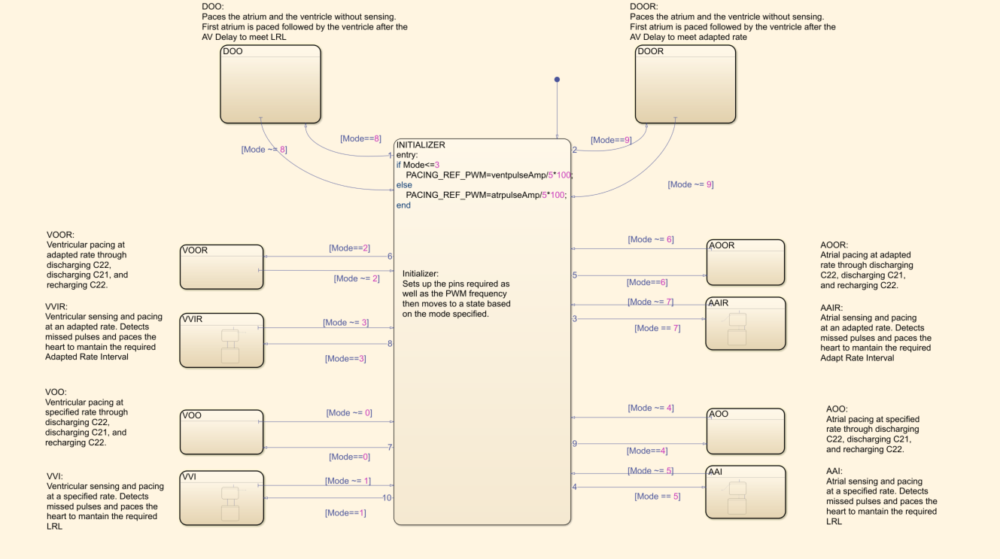
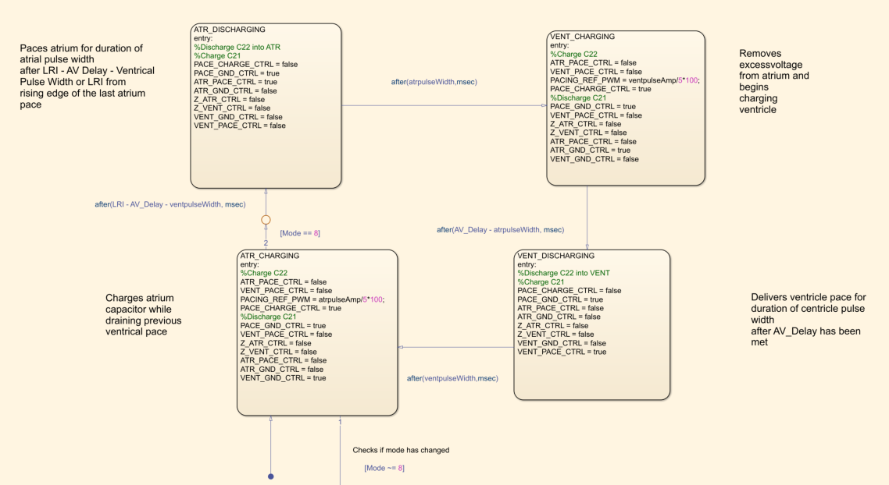
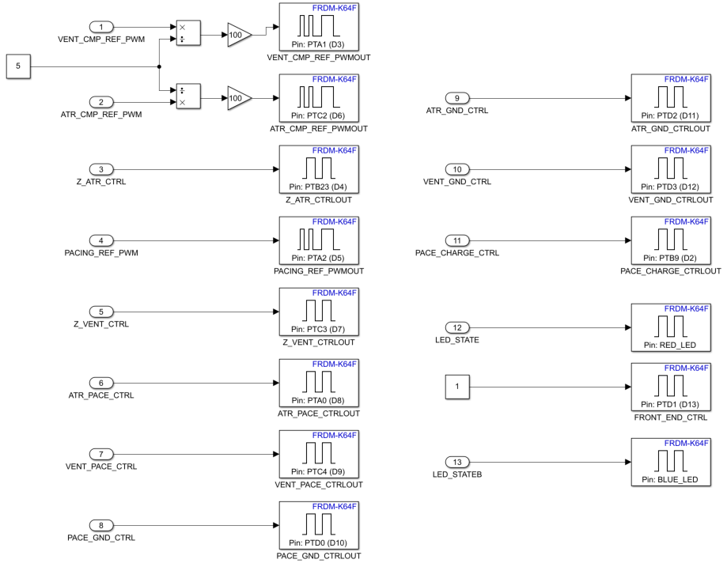
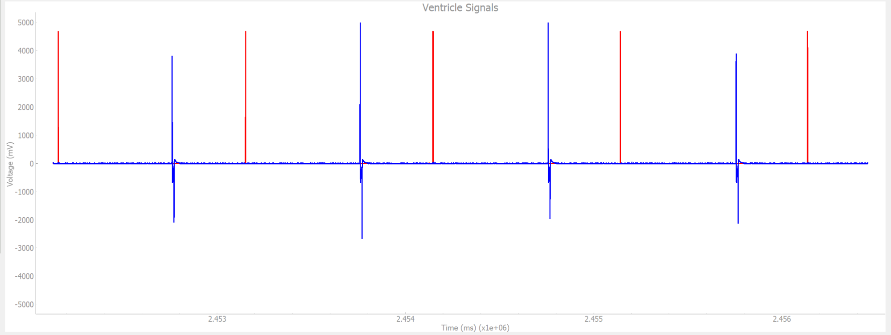

# Pacemaker
Coded a FRDM-K64F ARM development board to simulate a pacemaker using *Matlab's Simulink*. Followed the *software development life cycle* to create a *modular and readbale* design. Created stateflows to perform tasks such as sensing heart paces and delivering artifical paces. Traversed different stateflows using conditionals. Implemented pacing modes VOO, VOOR, AOO, AOOR, VVI, VVIR, AAI, AAIR, DOO, DOOR by adding logic for sending paces and detecting paces in both the ventricle and atrium of the heart. Used *serial communication* to send a recieve data from DCM. More information in Documenation 

## Toolboxes Used
- MATLAB®
- Simulink®
- Embedded Coder®
- Fixed-Point DesignerTM MATLAB CoderTM
- Simulink® CheckTM
- Simulink CoderTM
- Simulink CoverageTM
- Simulink Design VerifierTM Simulink Desktop Real-TimeTM Simulink TestTM
- Stateflow®
- Simulink® Coder Support Package for NXP FRDM-K64F -> Segger’s J-Link OpenSDA V2 firmware
- DSP Toolbox

## Model
The following is overall model which includes Input, Logic, and Output:

- Input: Serial communication input to recieve parameters and also send parameters back to the DCM to check that they were recieved correctly
- Logic: All modes with timing logic
- Output: Digital writes to board pins

## Initalization
The initial parameters which are set until the DCM passes in other parameters to the pacemaker which are then decoded and sent back to the DCM for checking

## Modes
Shown below are all the modes implemented along with the output pin initializations

### DOO Implemenation
The image below shows the logic for the dual pacing mode:

### Accelerometer Input
If a patient is exercising, their paced heart rate must be adjusted based on the level of activity. In order to determine this, input from an accelerometer is taken and converted from a 3D vector to a scalar quantity:

### Rate Adaptive Logic
The accelerometer input is then used to repeatedly calculate the pacing rate. To simulate the natural heart, the patients heart rate is slowly incremented and decremented based on the input from the accelerometer.

## Hardware Writes
The image below shows the values written and sent to the board's pins:

## Demonstration of VVI
VVI is a mode where the heart naturally beats (red) but requires the pacemaker to send artificial paces (blue) to meet the required rate. In the image below, the heart beats at 60 ppm while the required rate is 120 ppm:

